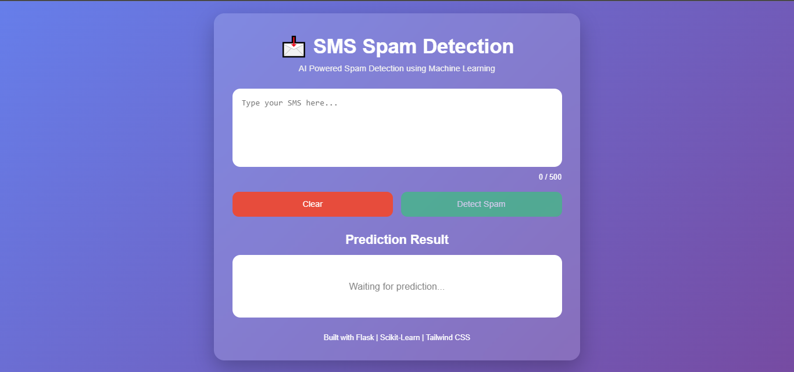
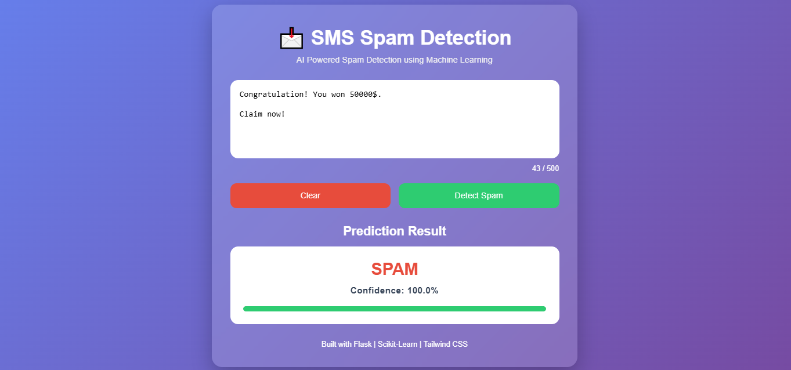
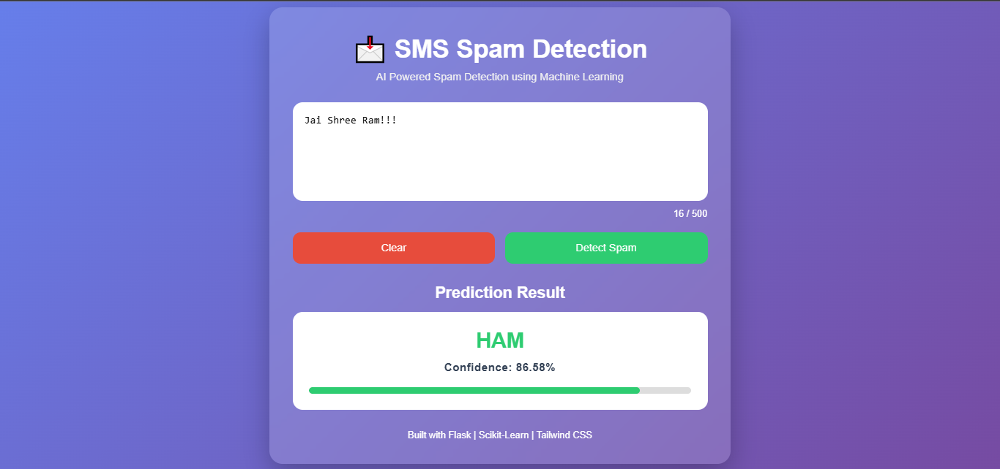

# 📩 SMS Spam Detection using Naive Bayes

An end-to-end Machine Learning web application that detects whether an SMS message is **Spam** or **Ham (Not Spam)** using **Natural Language Processing (NLP)** and the **Multinomial Naive Bayes** algorithm.

The project includes data preprocessing, feature extraction using CountVectorizer, model training, evaluation, confidence score prediction, and a Flask web application with a modern user interface.

---

## 🚀 Live Demo

> Add your deployed application link here (Render/Railway)

**Live Demo:** https://your-app-url.onrender.com

---

## 📸 Screenshots

### Home Page

> Add screenshot here



### Prediction Result

> Add screenshot here





---

# ✨ Features

- SMS Spam Classification
- Text Preprocessing Pipeline
- CountVectorizer Feature Extraction
- TF-IDF Comparison
- Multinomial Naive Bayes Classifier
- Confidence Score using `predict_proba()`
- Beautiful Flask UI
- Character Counter
- Auto-resizing Textarea
- Input Validation
- Responsive Design
- Modular Project Structure
- GitHub Ready

---

# 🧠 Machine Learning Workflow

```
SMS Message
      │
      ▼
Text Preprocessing
      │
      ▼
CountVectorizer
      │
      ▼
Multinomial Naive Bayes
      │
      ▼
Prediction
      │
      ▼
Confidence Score
```

---

# 🛠 Tech Stack

## Frontend

- HTML5
- CSS3
- JavaScript

## Backend

- Python
- Flask

## Machine Learning

- Scikit-learn
- NLTK
- Pandas
- NumPy

## Development Tools

- VS Code
- Git
- GitHub
- Jupyter Notebook

---

# 📂 Project Structure

```
SpamDetectionNaiveBayes/
│
├── app.py
├── requirements.txt
├── README.md
├── .gitignore
│
├── model/
│   ├── model.pkl
│   └── vectorizer.pkl
│
├── data/
│   └── SMSSpamCollection
│
├── notebooks/
│   └── EDA.ipynb
│
├── src/
│   ├── preprocess.py
│   ├── train.py
│   ├── predict.py
│   └── utils.py
│
├── templates/
│   ├── base.html
│   ├── index.html
│   └── result.html
│
├── static/
│   ├── css/
│   │   └── style.css
│   └── js/
│       └── script.js
│
└── screenshots/
```

---

# 📖 Dataset

Dataset Used:

**SMS Spam Collection Dataset**

- 5,572 SMS messages
- Binary Classification

Classes:

- Ham
- Spam

---

# ⚙️ Text Preprocessing

The following preprocessing steps were applied before training the model:

- Convert text to lowercase
- Remove punctuation
- Tokenization
- Remove stopwords
- Stemming using Porter Stemmer

---

# 📊 Feature Extraction

This project compares:

- CountVectorizer
- TF-IDF Vectorizer

The final deployed model uses:

**CountVectorizer + Multinomial Naive Bayes**

---

# 🤖 Machine Learning Model

Algorithm:

- Multinomial Naive Bayes

Why Multinomial Naive Bayes?

- Fast training
- Fast prediction
- Works well with text data
- Handles high-dimensional sparse matrices efficiently
- Excellent baseline for spam detection

---

# 📈 Model Performance

| Metric | Score |
|---------|--------|
| Accuracy | 98.20% |
| Precision | 96.40% |
| Recall | 89.93% |
| F1 Score | 93.66% |

*(Update these values if you retrain your model.)*

---

# 💡 Confidence Score

The application also displays the model's confidence using Scikit-learn's:

```python
predict_proba()
```

Example:

```
Prediction:
SPAM

Confidence:
98.74%
```

---

# ▶️ Installation

Clone the repository

```bash
git clone https://github.com/yourusername/SpamDetectionNaiveBayes.git
```

Move into the project directory

```bash
cd SpamDetectionNaiveBayes
```

Create virtual environment

```bash
python -m venv venv
```

Activate environment

### Windows

```bash
venv\Scripts\activate
```

### Linux / macOS

```bash
source venv/bin/activate
```

Install dependencies

```bash
pip install -r requirements.txt
```

Run the application

```bash
python app.py
```

Open your browser

```
http://127.0.0.1:5000
```

---

# 🧪 Example Predictions

| Message | Prediction |
|----------|------------|
| Congratulations! You won ₹5000 cash. | Spam |
| Hello, how are you? | Ham |
| Free entry in weekly competition. | Spam |
| Let's meet tomorrow at 5 PM. | Ham |

---

# 🔮 Future Improvements

- Deploy using Render
- REST API
- AJAX / Fetch API (No Page Reload)
- Probability Visualization
- Dark Mode
- Model Comparison Dashboard
- Deep Learning (LSTM/BERT)
- Docker Support

---

# 👨‍💻 Author

**Vinay Pal**

Aspiring Software Engineer | Python Developer | Machine Learning Enthusiast

GitHub:
https://github.com/VinayPal17

LinkedIn:
https://www.linkedin.com/in/vinay-pal-1a3109361

---

# ⭐ If you found this project useful

Please consider giving this repository a ⭐ on GitHub.